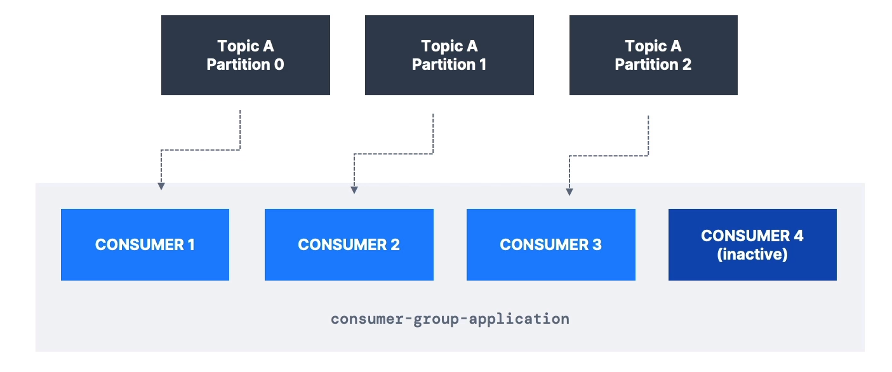
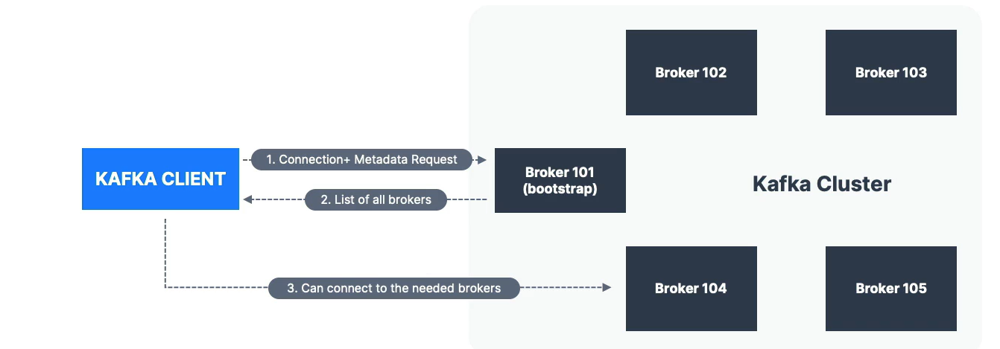
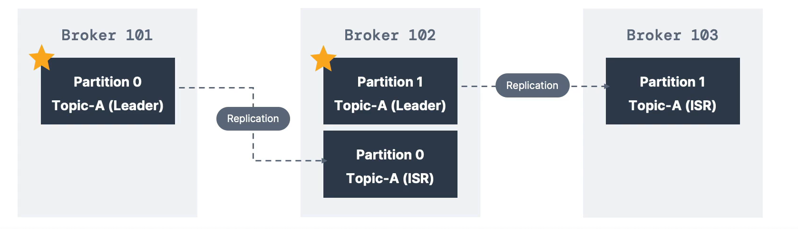

# Apache Kafka 

## What is Apache Kafka 
- Apache Kafka is a popular distributed streaming platform that allows you to collect, process, and transmit data in real-time across multiple applications and systems. It was initially developed at LinkedIn and later open-sourced as an Apache project.
- In simple terms, think of Kafka as a highly efficient and reliable "central nervous system" for your data. It serves as a middleman that facilitates communication between various parts of your software infrastructure, enabling seamless data flow and communication between different applications or microservices.

## Apache Kafka: Use Cases
- Messaging System
- Activity Tracking
- Applicatio Logs gathering
- Stream processing

## Examples of Kafka in use:
- Netflix uses kafka to real-time recommendations while watching TV shows.
- Uber use kafka to gather user, taxi and trip data in real time to compute demand and surge in pricing.
- LinkedIn uses kafka to prevent spam and collect user interation to make better connection recommendations in real time.

## Kafka Topics
- In simple terms, a Kafka topic is like a virtual channel or inbox where data is stored and organized within Apache Kafka. It's a named feed to which data can be sent and from which data can be read. You can have as many kafka topics created within you kafka cluster. A kafka topic is identified using its name given to it at its creation. Each topic can hold any kind of message format such as json, XML, CSV and many more. The sequence of messages within a topic is called a `data stream`. You are not able to query a topic like a database. Instead `Kafka Producers` is used to send data and `Kafka Consumers` is used to reaf data from these topics.

## Partitions and offsets
- `Partitions`: Each kakfa topic can be divided into 1 more partitions. Data related to a particular category or key is stored in a specific partition. Imagine a library with different shelves for different genres of books (e.g., Fiction, Non-fiction, Mystery). Each shelf is like a partition, and books related to a specific genre are placed in their respective shelves. This way, the library can handle a large collection of books more efficiently.
- `Offset`: An offset is like a bookmark that keeps track of where you left off reading in each partition. It's a unique number assigned to each message within a partition, like a page number in a book. When you read a message from a partition, you remember the offset (page number) of that message. The next time you come back to read, you start from the offset you remembered, so you don't miss any messages. It helps you keep your place and read messages in order. Each meesage within a partition gets an incremental ID which is referred to as an offset.
- IMPORTANT -> Kafka topics are `immutable`: once data is written to a partition, it cannot be changed.

- Diagram above shows a new truck_gps topic recieving multiple truck gps locations every 20 seconds and storing them within the 10 partitions created. Then making this data available for different services such as location dashboard or notification service. 

## Important Notes
- Once data is written to a partition, it cannot be changed `(immutability)`.
- Data is kept only for a limited time (default is one week - configurable).
- Offset only have a meaning for a specfic partition:
    - E.g. offset 3 in partition 0 doesnt represent the same data as offset 3 in partition 1.
    - Offsets are not re-used even if previous messages have been delete, they just keep incrementing.
- Order is guranteed order within a partition (not across partitions).
- Data us assigned randomly to partitions unless a `key` is provided.
- You can have as many partitions per topic as you want.

## Kafka Producers 
- Producers are what write data to topics (which are made of partitions).
- Producers know which partition to write to (and which kafka broker has it).
- In case of kafka broker failures, producers will automatically recover.

## Producers: Message keys
- Producers can choose to send a key with the message in the format of strings, numbers, binary, etc....
- If `key = null` then data is sent round robin (partition 0, then 1, then 2...).
- If `key != null` then all messages with that key will always go to the same partition (hashing).
- A key are typically sent if you need message ordering for a specific field (ex: truck_id).

## Kafka message anatomy

- A kafka message created by a producer comes with many parts. At the top are key and value which can both be null or store data. Both of these are in binary format when being sent to apache kafka. Underneath that we have the compression type which may be used if data needs to be made smaller. Below that we have the Headers which contains key value pairs about the data within the message. For example a header can contain information of the origin of the message such as the application or system. We then have which partition the data will be held at and a new unique offset is allocated to the data. The last thing is the timestamp of when the message was created this can be given by the system or set by a user. Once all of these are made and put together it is ready to be sent to apache kafka.

## Kafka Message Serializer
- It is important to note that kafka only accpets bytes as an input from producers and sends bytes out as an output to consumers. 
- Message serialization means transforming objects/data into bytes.
- This is used on keys and values.
- Common serializers are string, int, float, avro and protobuf.

## Kafka Consumers
- Consumers read data from a topic (identified by name) - pull model.
- Consumers automatically know which broker to read from.
- In case of broker failures, consumers know how to recover.
- Data is read in order from low to high offset `within each partitions`.

## Consumer Deserializer
- Deserialize indicates how to tranform bytes into object / data.
- They are used on the key and value of the message.
- Common deserializers are string, int, float, avro and protobuf.
- The Consumer must know the type beforehand to know which deserializer to use to change the bytes into objects/data.
- It is important the serializtion / deserialization type does not change during the topic lifecycle. (Create a new topic if you want type to change).

## Kafka Consumer Groups
- All the consumers in an application read data as consumer groups.
- Each consumer within a group reads data from exclusive partitions.
- To summarize, consumer groups in Kafka allow multiple consumers to work together, processing data from a topic in parallel, and enabling seamless scalability of data processing as your needs increase. It ensures that data is efficiently processed and no consumer is overwhelmed with the entire workload.

### What if there are more consumers than partitions?
- If there were to ever be a case where there are more consumers than partitions then the remaining consumers will be inactive and be on standby for any new partitions created which need data to be read from.

## Multiple Consumer in one topic
- In apache kafka it is acceptable to have multiple consumer groups on the same topic.
- To create distinct consumer groups, use the consumer property `group.id`.
- Reason to use multi-group consumers is to allowe multiple services to read from the same topic.

## Consumer Offsets
- Kafka stores the offsets at which a consumer group has been reading. 
- The offsets committed are in a kafka topic named `__consumer_offsets`.
- When a consumer in a group has processed data received from kafka, it should be periodically commiting the offsets (the kafka brojer will write to `__consumer_offsets`, not the group itself).
- If a consumer dies, it will be able to read back from where it left off thanks to the committed consumer offsets. 
- Heres how it works:
    - As a consumer reads messages from a partition, it keeps track of the current offset, which represents the position of the last message it has processed.
    - Periodically or after processing a batch of messages, the consumer commits its current offset to Kafka. This means it tells Kafka that it has successfully processed messages up to that particular offset.
    - The committed offset is then used to ensure that when the consumer restarts or encounters a failure, it can resume reading from where it left off. Kafka remembers the committed offset for each consumer group, allowing consumers to pick up where they stopped.
- By committing offsets, consumers achieve reliability and avoid processing the same message multiple times. If a consumer fails, another consumer in the same group can take over processing, starting from the last committed offset. This ensures that data processing is both efficient and fault-tolerant in Kafka's consumer groups.

## Delivery semantics for consumers
- By default, Java Consumers will automatically commit offsets (at least once)
- There are 3 delivery semantics if you choose to commit manually.
- At least once (usually preffered)
    - Offsets are commited after the message is processed.
    - If the processing goes wrong, the message will be read again.
    - This can result in duplicate processing of messages. Make sure processing is `indempotent` (i.e. processubg again the message wont impact the systems).
- At most once
    - Offsets are commited as soon as messages are recieved.
    - If the processing goes wrong, some messages will be lost (They will not be read again).
- Exactly once
    - For Kafka => kafka workflows: use the transactional API (easy with kafka streams API).
    - For Kafka => External System workflows: use an indempotent consumer.

## Kafka Brokers
- A kafka cluster is composed of multiple brokers (Servers).
- Each broker is identified with its ID (integer).
- Each broker contains certain topic partitions.
- After connecting to any broke, you will be connected to the entire cluster. (Kafka clients have a smart mechanic for this).
- A good number to get started is 3 brokers, but some clusters have over 100 brokers to get started.

- Example of Topic-A with 3 partitions and Topic-B with 2 partitions spread across 3 brokers.

## Kafka Broker Discovery
- Each kafka broker is also called a `bootstrap server`.
- That means that kafka client needs to only connect to one broker and it will automatically know how to connect to any broker within the kafka cluster.
- Each broker know about all the other brokers, topic and partitions within its cluster.

- The kafka client first tries to connect and request metadata from one of the brokers within the cluster. The broker then sends a list of all the broker, topics and partitions within its cluster. The client is then able to connect to the intended broker within the cluster to either write data (producers) or read data (consumers).

## Topic Replication
- Topics should have a replication factor > 1 (usually 2 or 3)
- This way is a broker is down, another broker can serve the data.

- Example: Topic-A with 2 partitions and replication factor of 2

- Example: we lose Broker 102.
- Result: Broker 101 and 103 can still serve the data.

## Concept of leader for a partition
- At any time only one broker can be a leader for a given partition.
- Producers can only send data to the broker that is leader of a partition.
- The ohter brokers will replicate the data.
- Therefore, each partition has one leader and multiple ISR (in-sync replica)

## Default produce & consumer behavior with leaders.
- Kafka Producers can only write to the leader broker for a partition.
- Kafka Consumers by default will read from the leader broker for a partition.

## Kafka Consumers replica fetching (Kafka v2.4+)
- Since the update it is possible to configure consumers to read from the closet replica.
- This may help improve latency, and also decrease network costs if using the cloud.

## Producers Acknowledgements (acks)
- Producers can choose to recieve acknowledgements of data writes:
    - acks=0: Producer wont wait for acknowledgement (possible data loss)
    - acks=1: Producer will wait for leader acknowledgement (limited data loss)
    - acks=all: Leader + replicas acknowledgement (no data loss)

## Kafka Topic Durability
- For a topic replication factor of 3, topic data durability can withstand 2 brokers loss.
- As a rule, for a replication factor of `N`, you can permanently lose up to `N-1` brokers and still recover your data.

## ZooKeeper
- Zookeeper manages brokers (keeps a list of them).
- Zookeeper help in performing leader election for partitions.
- Zookeeper sends notification such as metadata to kafka brokers in case of changes.
- kafka 2.x can't work without zookeeper || kafka 3.x can work without zookeeper using kafka raft instead || kafka 4.x will not have zookeeper
- Zookeeper work in odd number of servers
- Zookeeper has a leader (writes) the rest of the servers are followers (Reads).
- Zookeeper does not store consumer offsets with kafka > 0.10.

## Setting up Apache Kafka on workstation
- Follow the link for instructions on how to setup kafka on particular workstaions: `https://www.conduktor.io/kafka/starting-kafka/`.